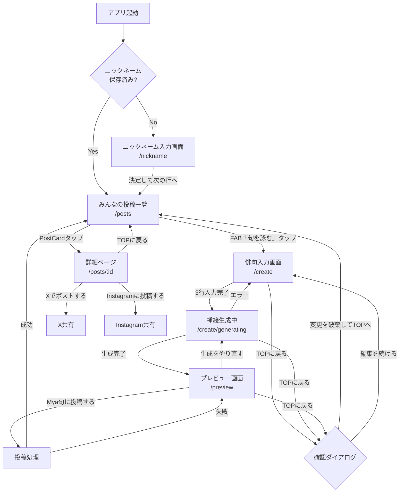

# ワイヤーフレーム設計仕様書

**ドキュメントバージョン:** 2.0
**作成日:** 2025-11-29
**最終更新日:** 2025-11-29
**フェーズ:** Phase 0: 設計準備
**優先度:** 🔴 高（実装前必須）
**担当者:** schwarzwald0906
**関連Issue:** [#20](https://github.com/MoguMoguDesign/flutter--hackathon-thema/issues/20)

---

## 1. 概要

### 1.1 目的

本ドキュメントは、俳句×AI画像生成Webアプリ「Mya句」のワイヤーフレーム設計仕様を定義する。各画面のレイアウト、コンポーネント配置、画面遷移フローを明確化し、実装フェーズへのスムーズな移行を目指す。

### 1.2 参考資料

| 資料 | パス/URL |
|------|----------|
| 要件定義書 | `docs/REQUIREMENTS.md` |
| アーキテクチャ設計書 | `docs/ARCHITECTURE.md` |
| スタイルガイド | `docs/STYLE_GUIDE.md` |
| ワイヤーフレーム画像 | `docs/design/*.png` |

### 1.3 設計指針

- **サービス名:** Mya句（仮称）
- **画像アスペクト比:** 4:5（Instagram縦型フィード形式）
- **レイアウトスタイル:** Pinterest風縦型フィード（Staggered Grid）
- **対応デバイス:** モバイル / デスクトップ（レスポンシブ対応）
- **俳句入力方式:** 3行ステップ入力（上の句・中の句・下の句）

---

## 2. 対象画面一覧

| # | 画面名 | ルート | 概要 | ワイヤーフレーム |
|---|--------|--------|------|----------------|
| 1 | ニックネーム入力画面 | `/nickname` | ユーザー識別用のニックネームを取得 | `ニックネーム入力.png` |
| 2 | みんなの投稿一覧画面 | `/posts` | 全ユーザーの俳句×画像投稿を閲覧 | `みんなの投稿.png` |
| 3 | 俳句入力画面 | `/create` | 俳句を3行ステップで入力 | `俳句入力.png` |
| 4 | 画像生成ローディング画面 | `/create/generating` | AI画像生成中のローディング表示 | `生成中....png` |
| 5 | プレビュー・投稿確認画面 | `/preview` | 生成画像と俳句を確認、投稿実行 | `プレビュー 投稿する.png` |
| 6 | 詳細ページ | `/posts/:id` | 投稿詳細とSNS共有 | `詳細ページ.png` |
| 7 | 編集中に戻るダイアログ | - | 編集破棄の確認モーダル | `編集中に戻る.png` |

---

## 3. 画面詳細仕様

### 3.1 ニックネーム入力画面

**目的:** ユーザー識別用のニックネームを取得し、localStorageに保存
**ワイヤーフレーム:** `ニックネーム入力.png`

#### UI構成

```
┌─────────────────────────────────────┐
│                                     │
│    ┌───────────────────────┐        │
│    │                       │        │
│    │      サービス名        │        │
│    │     （ロゴエリア）      │        │
│    │                       │        │
│    └───────────────────────┘        │
│                                     │
│    ニックネーム                       │
│    ┌───────────────────────┐        │
│    │ ニックネームを入力      │        │
│    └───────────────────────┘        │
│                                     │
│    ┌───────────────────────┐        │
│    │   決定して次の行へ      │        │
│    └───────────────────────┘        │
│                                     │
└─────────────────────────────────────┘
```

#### コンポーネント

| コンポーネント | 仕様 |
|--------------|------|
| ロゴエリア | サービス名表示、正方形プレースホルダー |
| ラベル | 「ニックネーム」 |
| テキストフィールド | プレースホルダー: 「ニックネームを入力」、角丸、グレー背景 |
| バリデーション | 空文字禁止、1〜20文字 |
| ボタン | 「決定して次の行へ」- 黒背景、白文字、角丸 |

#### 遷移ルール

- **「決定して次の行へ」タップ:** `/posts`（みんなの投稿一覧）へ遷移
- **再訪時:** ニックネーム保存済みなら自動で `/posts` へリダイレクト

---

### 3.2 みんなの投稿一覧画面（コミュニティ投稿フィード）

**目的:** 全ユーザーの俳句×画像投稿を閲覧
**ワイヤーフレーム:** `みんなの投稿.png`

#### UI構成

```
┌─────────────────────────────────────┐
│  サービス名                          │
├─────────────────────────────────────┤
│      ┌──────┐                       │
│      │なんか │                       │
│      │装飾画像│                       │
│      └──────┘                       │
│ ┌─────────┐  ┌─────────┐            │
│ │         │  │         │            │
│ │ 画像    │  │ 画像    │            │
│ │         │  │         │            │
│ │         │  │         │            │
│ └─────────┘  └─────────┘            │
│ ┌─────────┐  ┌─────────┐            │
│ │         │  │         │            │
│ │ 画像    │  │ 画像    │            │
│ │         │  │         │            │
│ └─────────┘  └─────────┘            │
│                                     │
│                        ┌─────────┐  │
│                        │  ＋     │  │
│                        │ 句を詠む │  │
│                        └─────────┘  │
└─────────────────────────────────────┘
```

#### コンポーネント

| コンポーネント | 仕様 |
|--------------|------|
| ヘッダー | サービス名（テキスト） |
| 装飾画像 | 丸型、「なんか装飾画像」配置 |
| Staggered Grid | Pinterest風レイアウト、2カラム（モバイル） |
| PostCard | 画像のみ（タップで詳細へ） |
| FAB | 右下配置、黒背景、「+ 句を詠む」テキスト付き |

#### データ表示

- **ソート:** 新着順（createdAt DESC）
- **ページネーション:** 無限スクロール
- **リアルタイム更新:** Firestore リスナー

#### 遷移ルール

- **PostCardタップ:** `/posts/:id`（詳細ページ）へ遷移
- **FABタップ:** `/create`（俳句入力画面）へ遷移

---

### 3.3 俳句入力画面

**目的:** 俳句を3行ステップ形式で入力し、AI画像生成をリクエスト
**ワイヤーフレーム:** `俳句入力.png`

#### UI構成

```
┌─────────────────────────────────────┐
│  サービス名                          │
├─────────────────────────────────────┤
│  ＜ TOPに戻る                        │
│                                     │
│            句を詠む                  │
│                                     │
│    ┌───────────────────────┐        │
│    │  ┌─┐  ┌─┐  ┌─┐       │        │
│    │  │た│  │入│  │増│       │        │
│    │  │て│  │力│  │え│       │        │
│    │  │が│  │し│  │て│       │        │
│    │  │き│  │た│  │い│       │        │
│    │  │で│  │の│  │く│       │        │
│    │  │  │  │が│  │  │       │        │
│    │  └─┘  └─┘  └─┘       │        │
│    └───────────────────────┘        │
│                                     │
│    手順  ○────●────○              │
│                                     │
│    真ん中の行                        │
│    ┌───────────────────────┐        │
│    │ 真ん中の行を入力        │        │
│    └───────────────────────┘        │
│                                     │
│    ┌───────────────────────┐        │
│    │   決定して次の行へ      │        │
│    └───────────────────────┘        │
│                                     │
└─────────────────────────────────────┘
```

#### コンポーネント

| コンポーネント | 仕様 |
|--------------|------|
| ヘッダー | サービス名 |
| 戻るボタン | 「< TOPに戻る」- 確認ダイアログ表示 |
| タイトル | 「句を詠む」 |
| 縦書きプレビュー | 入力した俳句を縦書きでリアルタイム表示 |
| ステッパー | 手順インジケーター（3ステップ：上の句・中の句・下の句） |
| 行ラベル | 現在入力中の行（「真ん中の行」等） |
| テキストフィールド | プレースホルダー: 「真ん中の行を入力」、角丸、グレー背景 |
| ボタン | 「決定して次の行へ」- 黒背景、白文字 |

#### 入力フロー（3ステップ）

| ステップ | ラベル | プレースホルダー |
|---------|--------|----------------|
| 1 | 上の句 | 「上の句を入力」 |
| 2 | 真ん中の行 | 「真ん中の行を入力」 |
| 3 | 下の句 | 「下の句を入力」 |

#### 遷移ルール

- **「決定して次の行へ」タップ（ステップ1-2）:** 次のステップへ
- **「決定して次の行へ」タップ（ステップ3）:** `/create/generating`（生成中画面）へ遷移
- **「< TOPに戻る」タップ:** 確認ダイアログを表示

---

### 3.4 画像生成ローディング画面

**目的:** AI画像（挿絵）生成中のローディング状態を表示
**ワイヤーフレーム:** `生成中....png`

#### UI構成

```
┌─────────────────────────────────────┐
│  サービス名                          │
├─────────────────────────────────────┤
│  ＜ TOPに戻る                        │
│                                     │
│                                     │
│         挿絵を生成中...              │
│                                     │
│    ┌───────────────────────┐        │
│    │                       │        │
│    │    待機中アニメーション  │        │
│    │                       │        │
│    │                       │        │
│    └───────────────────────┘        │
│                                     │
│    ████████████░░░░░░░░░░░          │
│    （プログレスバー）                 │
│                                     │
└─────────────────────────────────────┘
```

#### コンポーネント

| コンポーネント | 仕様 |
|--------------|------|
| ヘッダー | サービス名 |
| 戻るボタン | 「< TOPに戻る」- 確認ダイアログ表示 |
| テキスト | 「挿絵を生成中...」 |
| アニメーションエリア | 待機中アニメーション表示 |
| プログレスバー | 進捗表示（黒/グレー） |

#### 状態管理

- **タイムアウト:** 60秒（DALL-E 3 API考慮）
- **キャンセル:** 可能（「< TOPに戻る」で確認ダイアログ表示）

---

### 3.5 プレビュー・投稿確認画面

**目的:** 生成された画像と俳句を確認し、投稿または再生成を選択
**ワイヤーフレーム:** `プレビュー 投稿する.png`

#### UI構成

```
┌─────────────────────────────────────┐
│  サービス名                          │
├─────────────────────────────────────┤
│  ＜ TOPに戻る                        │
│                                     │
│    ┌───────────────────────┐        │
│    │                       │        │
│    │      生成された画像     │        │
│    │                       │        │
│    │                       │        │
│    │                       │        │
│    │                       │        │
│    └───────────────────────┘        │
│                                     │
│    ┌───────────────────────┐        │
│    │  ↻ 生成をやり直す      │        │
│    └───────────────────────┘        │
│                                     │
│    ┌───────────────────────┐        │
│    │   Mya句に投稿する      │        │
│    └───────────────────────┘        │
│                                     │
└─────────────────────────────────────┘
```

#### コンポーネント

| コンポーネント | 仕様 |
|--------------|------|
| ヘッダー | サービス名 |
| 戻るボタン | 「< TOPに戻る」- 確認ダイアログ表示 |
| 画像プレビュー | 生成画像、縦長表示 |
| 「生成をやり直す」ボタン | アウトライン、リロードアイコン付き |
| 「Mya句に投稿する」ボタン | 黒背景、白文字 |

#### 投稿ワークフロー

1. 「Mya句に投稿する」タップ
2. 画像を Firebase Storage にアップロード
3. Firestore にドキュメント作成
4. 成功トースト表示
5. `/posts` へ遷移

#### 遷移ルール

- **「生成をやり直す」タップ:** `/create/generating`（生成中画面）へ遷移、再度API呼び出し
- **「Mya句に投稿する」タップ:** 投稿処理実行後 `/posts` へ遷移
- **「< TOPに戻る」タップ:** 確認ダイアログを表示

---

### 3.6 詳細ページ

**目的:** 投稿の詳細表示とSNS共有機能
**ワイヤーフレーム:** `詳細ページ.png`

#### UI構成

```
┌─────────────────────────────────────┐
│  サービス名                          │
├─────────────────────────────────────┤
│  ＜ TOPに戻る                        │
│                                     │
│    ┌───────────────────────┐        │
│    │                       │        │
│    │        画像           │        │
│    │                       │        │
│    │                       │        │
│    │                       │        │
│    │                       │        │
│    └───────────────────────┘        │
│                                     │
│    なほもり 作            ♡ 15      │
│                                     │
│    ┌───────────────────────┐        │
│    │  𝕏  Xでポストする      │        │
│    └───────────────────────┘        │
│                                     │
│    ┌───────────────────────┐        │
│    │  📷 Instagramに投稿する │        │
│    └───────────────────────┘        │
│                                     │
└─────────────────────────────────────┘
```

#### コンポーネント

| コンポーネント | 仕様 |
|--------------|------|
| ヘッダー | サービス名 |
| 戻るボタン | 「< TOPに戻る」 |
| 画像 | 投稿画像、縦長表示 |
| 作者情報 | 「{ニックネーム} 作」 |
| いいねボタン | ♡アイコン + カウント数 |
| 「Xでポストする」ボタン | Xアイコン、黒背景、白文字 |
| 「Instagramに投稿する」ボタン | Instagramアイコン、黒背景、白文字 |

#### SNS共有機能

| SNS | 共有内容 |
|-----|---------|
| X (Twitter) | 俳句テキスト + 画像URL + ハッシュタグ |
| Instagram | 画像ダウンロード → Instagram アプリ起動 |

#### 遷移ルール

- **「< TOPに戻る」タップ:** `/posts`（みんなの投稿一覧）へ遷移
- **「Xでポストする」タップ:** X共有画面を開く（外部リンク）
- **「Instagramに投稿する」タップ:** Instagram共有フロー

---

### 3.7 編集中に戻るダイアログ

**目的:** 編集中のデータ破棄確認
**ワイヤーフレーム:** `編集中に戻る.png`

#### UI構成

```
┌─────────────────────────────────────┐
│                                     │
│    ┌───────────────────────┐        │
│    │                       │        │
│    │  TOPに戻りますか？     │        │
│    │                       │        │
│    │ 作成中の句は保存され    │        │
│    │ ません。               │        │
│    │                       │        │
│    │ ┌─────────────────┐   │        │
│    │ │変更を破棄してTOPへ│   │        │
│    │ └─────────────────┘   │        │
│    │                       │        │
│    │ ┌─────────────────┐   │        │
│    │ │   編集を続ける   │   │        │
│    │ └─────────────────┘   │        │
│    │                       │        │
│    └───────────────────────┘        │
│                                     │
└─────────────────────────────────────┘
```

#### コンポーネント

| コンポーネント | 仕様 |
|--------------|------|
| タイトル | 「TOPに戻りますか？」 |
| 説明文 | 「作成中の句は保存されません。」 |
| 「変更を破棄してTOPへ」ボタン | 黒背景、白文字 |
| 「編集を続ける」ボタン | アウトライン |

#### 表示条件

- 俳句入力画面で「< TOPに戻る」タップ時
- 生成中画面で「< TOPに戻る」タップ時
- プレビュー画面で「< TOPに戻る」タップ時

---

## 4. 画面遷移フロー

### 4.1 フロー図（Mermaid）



### 4.2 テキストフロー

```
[ニックネーム入力画面]
       ↓ 「決定して次の行へ」タップ
[みんなの投稿一覧]
       ↓ FAB「+ 句を詠む」タップ
[俳句入力画面 - 上の句]
       ↓ 「決定して次の行へ」タップ
[俳句入力画面 - 真ん中の行]
       ↓ 「決定して次の行へ」タップ
[俳句入力画面 - 下の句]
       ↓ 「決定して次の行へ」タップ
[挿絵生成中ローディング]
       ↓ 生成完了
[プレビュー・確認画面]
       ↓ 「Mya句に投稿する」タップ
[Storage保存 → Firestore保存]
       ↓ 成功
[みんなの投稿一覧へ戻る]
```

---

## 5. レスポンシブ対応仕様

### 5.1 ブレークポイント

| デバイス | 幅 | グリッドカラム数 |
|---------|-----|-----------------|
| モバイル | < 600px | 2カラム |
| タブレット | 600px - 1024px | 3カラム |
| デスクトップ | > 1024px | 4カラム |

### 5.2 モバイル固有の考慮事項

- タッチターゲット: 最小44×44px
- スワイプジェスチャー: 無限スクロール
- キーボード表示時のレイアウト調整
- 縦書きプレビューの適切なサイズ調整

### 5.3 デスクトップ固有の考慮事項

- ホバーエフェクト
- マウスホイールスクロール
- 最大コンテンツ幅の設定（1200px推奨）

---

## 6. 共通UIコンポーネント一覧

### 6.1 ボタン

| 種類 | 用途 | スタイル |
|------|------|---------|
| Primary Button | 主要アクション | 黒背景、白文字、角丸 |
| Secondary Button | 副次アクション | アウトライン、黒枠 |
| Text Button | ナビゲーション | テキストのみ（「< TOPに戻る」） |
| FAB | 新規作成 | 黒背景、「+ 句を詠む」テキスト付き |
| SNS Button | SNS共有 | アイコン + テキスト、黒背景 |

### 6.2 入力フィールド

| 種類 | 用途 | 仕様 |
|------|------|------|
| TextField（単行） | ニックネーム入力 | 1〜20文字、角丸、グレー背景 |
| TextField（単行） | 俳句行入力 | 各行入力、角丸、グレー背景 |

### 6.3 フィードバック

| 種類 | 用途 |
|------|------|
| SnackBar/Toast | 成功・エラー通知 |
| Loading Indicator | 処理中表示（アニメーション） |
| Progress Bar | 生成進捗表示 |
| Confirm Dialog | 破棄確認モーダル |

### 6.4 カード・表示要素

| 種類 | 用途 | 構成 |
|------|------|------|
| PostCard | 投稿サムネイル | 画像のみ |
| 縦書きプレビュー | 俳句プレビュー | 3列縦書きテキスト |
| ステッパー | 入力進捗 | 3ステップインジケーター |

### 6.5 ナビゲーション

| 種類 | 用途 |
|------|------|
| ヘッダー | サービス名表示 |
| 戻るボタン | 「< TOPに戻る」 |

---

## 7. タスクチェックリスト

### 7.1 ワイヤーフレーム作成タスク

- [x] 画面遷移フローの整理
- [x] 各画面のレイアウト設計
- [x] コンポーネント配置の決定
- [ ] レスポンシブ対応の検討（モバイル/デスクトップ）
- [x] Figma または手書きでワイヤーフレーム作成
- [ ] チームレビューの実施

### 7.2 成果物

- [x] ワイヤーフレーム画像（`docs/design/*.png`）
- [x] 本ドキュメントの更新（ワイヤーフレーム反映）

---

## 8. レビュー記録

### 8.1 チームレビュー

| 日付 | 参加者 | 主なフィードバック | 対応状況 |
|------|--------|------------------|---------|
| - | - | - | - |

### 8.2 変更履歴

| バージョン | 日付 | 変更内容 | 担当者 |
|-----------|------|---------|--------|
| 1.0 | 2025-11-29 | 初版作成（Issue #20より） | Claude Code |
| 2.0 | 2025-11-29 | ワイヤーフレーム画像に基づき全面更新 | Claude Code |

**v2.0 主な変更点:**
- 俳句入力を3行ステップ形式に変更
- 縦書きプレビュー機能を追加
- 詳細ページ（SNS共有機能）を追加
- 編集中に戻るダイアログを追加
- UI文言をワイヤーフレームに合わせて更新
- サービス名「Mya句」を反映

---

## 付録

### A. ワイヤーフレーム画像一覧

| ファイル名 | 対応画面 |
|-----------|---------|
| `ニックネーム入力.png` | 3.1 ニックネーム入力画面 |
| `みんなの投稿.png` | 3.2 みんなの投稿一覧画面 |
| `俳句入力.png` | 3.3 俳句入力画面 |
| `生成中....png` | 3.4 画像生成ローディング画面 |
| `プレビュー 投稿する.png` | 3.5 プレビュー・投稿確認画面 |
| `詳細ページ.png` | 3.6 詳細ページ |
| `編集中に戻る.png` | 3.7 編集中に戻るダイアログ |

### B. 関連ドキュメント

- [要件定義書](../REQUIREMENTS.md)
- [アーキテクチャ設計書](../ARCHITECTURE.md)
- [スタイルガイド](../STYLE_GUIDE.md)

### C. 関連Issue

- [#20 ワイヤーフレーム作成](https://github.com/MoguMoguDesign/flutter--hackathon-thema/issues/20)
- [#8 プロジェクト構造整理](https://github.com/MoguMoguDesign/flutter--hackathon-thema/issues/8)
- [#9 ルーティング設定](https://github.com/MoguMoguDesign/flutter--hackathon-thema/issues/9)
