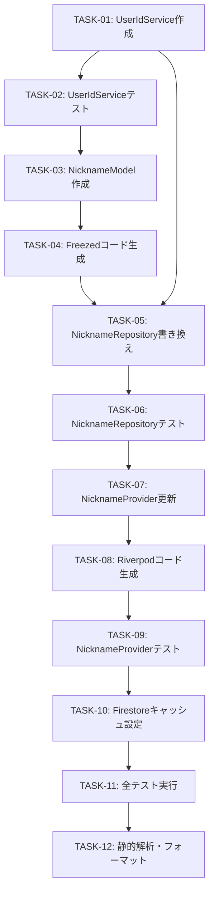

# PLAN Phase: ニックネームのFirebase連携実装計画

**計画日時**: 2025-11-29 21:44:50
**対象ブランチ**: feat/nickname
**アーキテクチャ層**: Feature Layer
**プランナー**: Claude Code

---

## 目次

1. [実装戦略の概要](#1-実装戦略の概要)
2. [タスク分解と優先順位](#2-タスク分解と優先順位)
3. [ファイル変更計画](#3-ファイル変更計画)
4. [包括的テスト戦略](#4-包括的テスト戦略)
5. [技術スタック互換性](#5-技術スタック互換性)
6. [リスク分析と対応策](#6-リスク分析と対応策)
7. [実装フロー](#7-実装フロー)
8. [コード生成戦略](#8-コード生成戦略)
9. [成功基準](#9-成功基準)
10. [実装後の確認事項](#10-実装後の確認事項)

---

## 1. 実装戦略の概要

### 1.1 目的

現在のSharedPreferencesベースのニックネーム保存機能を、Firebase Firestoreを使用したクラウドベースの実装に移行する。

### 1.2 主要な技術的決定事項

| 項目 | 決定内容 | 理由 |
|------|---------|------|
| **ユーザーID管理** | UUIDv4ベースのデバイスID | 匿名ユーザー対応、将来のAuth移行が容易 |
| **データモデル** | Freezed + JSON Serializable | イミュータブル、型安全、コード生成 |
| **リポジトリパターン** | FirestoreRepository<T>継承 | 共通CRUD操作の再利用、テスト容易性 |
| **テスト戦略** | FakeFirebaseFirestore | Firestoreの動作を完全にモック |
| **オフライン対応** | Firestoreキャッシュ有効化 | ネットワーク不要時でも動作 |
| **データ構造** | users/{userId}フラット構造 | シンプル、クエリ効率良 |

### 1.3 実装アプローチ

**段階的実装** - 既存機能を壊さず、段階的にFirestoreへ移行

1. **Phase 1**: 新規コンポーネント作成（UserIdService, NicknameModel）
2. **Phase 2**: リポジトリの移行（NicknameRepository）
3. **Phase 3**: プロバイダーの更新（NicknameProvider）
4. **Phase 4**: テストの全面更新
5. **Phase 5**: 統合と検証

### 1.4 アーキテクチャ準拠

✅ **三層アーキテクチャ準拠**:
- Feature層（nickname）→ Shared層（FirestoreRepository, FirebaseService）
- Feature間依存なし
- Sharedは独立

✅ **依存関係の方向**:
```
lib/features/nickname/
  ├── service/user_id_service.dart        # SharedPreferences使用（Shared層）
  ├── data/models/nickname_model.dart     # Freezed使用
  ├── data/repositories/nickname_repository.dart
  │   └─→ extends FirestoreRepository<NicknameModel>  # Shared層
  └── presentation/providers/nickname_provider.dart
      └─→ uses NicknameRepository
```

---

## 2. タスク分解と優先順位

### 2.1 実装タスク一覧

| 優先度 | タスクID | タスク名 | 見積時間 | 依存関係 |
|-------|---------|---------|---------|---------|
| **P0** | TASK-01 | UserIdServiceの作成 | 30分 | なし |
| **P0** | TASK-02 | UserIdServiceのテスト作成 | 30分 | TASK-01 |
| **P1** | TASK-03 | NicknameModelの作成 | 20分 | なし |
| **P1** | TASK-04 | コード生成（Freezed） | 5分 | TASK-03 |
| **P2** | TASK-05 | NicknameRepositoryの書き換え | 40分 | TASK-01, TASK-03 |
| **P2** | TASK-06 | NicknameRepositoryのテスト更新 | 45分 | TASK-05 |
| **P3** | TASK-07 | NicknameProviderの更新 | 30分 | TASK-05 |
| **P3** | TASK-08 | コード生成（Riverpod） | 5分 | TASK-07 |
| **P3** | TASK-09 | NicknameProviderのテスト更新 | 30分 | TASK-07 |
| **P4** | TASK-10 | main.dartでFirestoreキャッシュ設定 | 10分 | なし |
| **P4** | TASK-11 | 全テスト実行と確認 | 15分 | 全タスク |
| **P4** | TASK-12 | 静的解析とフォーマット | 10分 | 全タスク |

**合計見積時間**: 約4時間

### 2.2 タスク詳細

#### TASK-01: UserIdServiceの作成 (P0)

**ファイル**: `lib/features/nickname/service/user_id_service.dart`

**実装内容**:
- UUIDv4でユーザーIDを生成
- SharedPreferencesに保存・取得
- テスト用のクリア機能

**受け入れ基準**:
- [ ] getUserId()で既存IDを取得、なければ生成
- [ ] 生成されたIDはSharedPreferencesに永続化
- [ ] clearUserId()でIDを削除可能
- [ ] 日本語ドキュメント完備

#### TASK-02: UserIdServiceのテスト作成 (P0)

**ファイル**: `test/features/nickname/service/user_id_service_test.dart`

**テストケース**:
1. 初回呼び出し時にUUID生成
2. 2回目以降は同じIDを返す
3. IDが正しくSharedPreferencesに保存される
4. clearUserId()で削除できる

**カバレッジ目標**: 100%

#### TASK-03: NicknameModelの作成 (P1)

**ファイル**: `lib/features/nickname/data/models/nickname_model.dart`

**実装内容**:
- Freezedでイミュータブルモデル定義
- フィールド: `nickname` (String), `updatedAt` (DateTime)
- JSON Serializable対応

**受け入れ基準**:
- [ ] Freezedアノテーション使用
- [ ] fromJson/toJsonメソッド自動生成
- [ ] 日本語ドキュメント完備

#### TASK-04: コード生成（Freezed） (P1)

**コマンド**:
```bash
fvm flutter pub run build_runner build --delete-conflicting-outputs
```

**生成ファイル**:
- `nickname_model.freezed.dart`
- `nickname_model.g.dart`

#### TASK-05: NicknameRepositoryの書き換え (P2)

**ファイル**: `lib/features/nickname/data/repositories/nickname_repository.dart`

**変更内容**:
- `FirestoreRepository<NicknameModel>`を継承
- UserIdServiceをDI
- fromFirestore/toFirestoreを実装
- メソッド名変更: getNickname → read, saveNickname → create/update
- collectionPath: `users`

**受け入れ基準**:
- [ ] FirestoreRepository基底クラス継承
- [ ] UserIdServiceでuserIdを取得
- [ ] ニックネーム取得・保存・削除が動作
- [ ] 日本語ドキュメント維持

#### TASK-06: NicknameRepositoryのテスト更新 (P2)

**ファイル**: `test/features/nickname/data/repositories/nickname_repository_test.dart`

**変更内容**:
- FakeFirebaseFirestoreを使用
- UserIdServiceをモック化
- 既存テストケースをFirestore版に書き換え

**テストケース** (最低10個):
1. ニックネーム取得（存在しない → null）
2. ニックネーム保存（新規作成）
3. ニックネーム保存（上書き）
4. ニックネーム削除
5. 空文字列の保存
6. 日本語ニックネームの保存
7. 特殊文字を含むニックネームの保存
8. 20文字のニックネームの保存
9. UserIdServiceのモック動作確認
10. Firestoreエラーハンドリング

**カバレッジ目標**: 95%以上

#### TASK-07: NicknameProviderの更新 (P3)

**ファイル**: `lib/features/nickname/presentation/providers/nickname_provider.dart`

**変更内容**:
- NicknameRepositoryの新メソッド名に対応
- `NicknameModel`を使用
- 状態管理ロジックは維持

**受け入れ基準**:
- [ ] @riverpodアノテーション維持
- [ ] build()でニックネーム初期化
- [ ] setNickname()で保存
- [ ] clearNickname()で削除
- [ ] AsyncValueでエラーハンドリング

#### TASK-08: コード生成（Riverpod） (P3)

**コマンド**:
```bash
fvm flutter pub run build_runner build --delete-conflicting-outputs
```

**生成ファイル**:
- `nickname_provider.g.dart`

#### TASK-09: NicknameProviderのテスト更新 (P3)

**ファイル**: `test/features/nickname/presentation/providers/nickname_provider_test.dart`

**テストケース**:
1. 初期状態（ニックネームなし）
2. ニックネーム設定成功
3. ニックネームクリア成功
4. リポジトリエラー時の挙動
5. AsyncValue状態遷移

**カバレッジ目標**: 90%以上

#### TASK-10: main.dartでFirestoreキャッシュ設定 (P4)

**ファイル**: `lib/main.dart`

**追加内容**:
```dart
// Firebase初期化後に追加
FirebaseFirestore.instance.settings = const Settings(
  persistenceEnabled: true,
  cacheSizeBytes: Settings.CACHE_SIZE_UNLIMITED,
);
```

**受け入れ基準**:
- [ ] オフライン時でもキャッシュから読み取り可能
- [ ] 設定がFirebase初期化後に実行される

#### TASK-11: 全テスト実行と確認 (P4)

**コマンド**:
```bash
fvm flutter test
fvm flutter test --coverage
```

**確認項目**:
- [ ] 全テストがパス
- [ ] カバレッジ80%以上
- [ ] 既存のnickname_page_test.dartも動作

#### TASK-12: 静的解析とフォーマット (P4)

**コマンド**:
```bash
fvm flutter analyze
dart format --set-exit-if-changed .
```

**受け入れ基準**:
- [ ] analyzeエラーゼロ
- [ ] フォーマット違反ゼロ

---

## 3. ファイル変更計画

### 3.1 新規作成ファイル（3ファイル + テスト2ファイル）

#### 実装ファイル

| # | ファイルパス | 目的 | 行数目安 |
|---|------------|------|---------|
| 1 | `lib/features/nickname/service/user_id_service.dart` | ユーザーID管理 | 50行 |
| 2 | `lib/features/nickname/data/models/nickname_model.dart` | ニックネームモデル | 30行 |
| 3 | `lib/features/nickname/data/models/nickname_model.freezed.dart` | 自動生成 | - |
| 4 | `lib/features/nickname/data/models/nickname_model.g.dart` | 自動生成 | - |

#### テストファイル

| # | ファイルパス | 目的 | 行数目安 |
|---|------------|------|---------|
| 1 | `test/features/nickname/service/user_id_service_test.dart` | UserIdServiceテスト | 80行 |

### 3.2 修正ファイル（3ファイル + テスト2ファイル）

| # | ファイルパス | 変更内容 | 影響度 |
|---|------------|---------|-------|
| 1 | `lib/features/nickname/data/repositories/nickname_repository.dart` | 全面書き換え（SharedPreferences→Firestore） | 高 |
| 2 | `lib/features/nickname/presentation/providers/nickname_provider.dart` | メソッド名変更、NicknameModel使用 | 中 |
| 3 | `lib/main.dart` | Firestoreキャッシュ設定追加 | 低 |
| 4 | `test/features/nickname/data/repositories/nickname_repository_test.dart` | 全面書き換え（FakeFirebaseFirestore使用） | 高 |
| 5 | `test/features/nickname/presentation/providers/nickname_provider_test.dart` | NicknameModel対応 | 中 |

### 3.3 削除ファイル

**なし** - 既存ファイルは全て修正で対応

### 3.4 影響を受ける可能性のあるファイル（要確認）

| ファイルパス | 確認内容 | 対応 |
|------------|---------|-----|
| `lib/app/route_guard/nickname_guard.dart` | プロバイダー参照方法 | 変更なし（API互換） |
| `lib/features/nickname/presentation/pages/nickname_page.dart` | プロバイダー使用方法 | 変更なし（API互換） |
| `test/features/nickname/presentation/pages/nickname_page_test.dart` | ウィジェットテスト | 変更なし（内部実装のみ変更） |

---

## 4. 包括的テスト戦略

### 4.1 テスト構成の全体像

```
test/features/nickname/
├── service/
│   └── user_id_service_test.dart          # 新規 (4テストケース)
├── data/
│   ├── models/
│   │   └── nickname_model_test.dart       # オプション (Freezed検証)
│   └── repositories/
│       └── nickname_repository_test.dart  # 更新 (10+テストケース)
└── presentation/
    ├── providers/
    │   └── nickname_provider_test.dart    # 更新 (5テストケース)
    └── pages/
        └── nickname_page_test.dart        # 既存維持
```

### 4.2 単体テスト（Unit Tests）

#### 4.2.1 UserIdServiceのテスト

**ファイル**: `test/features/nickname/service/user_id_service_test.dart`

**テストケース**:

| # | テスト名 | 検証内容 | モック |
|---|---------|---------|-------|
| 1 | `初回呼び出し時にUUIDを生成する` | SharedPreferencesにID保存 | SharedPreferences |
| 2 | `既存のIDを返す` | 2回目以降は同じIDを返す | SharedPreferences |
| 3 | `UUID形式が正しい` | v4形式のUUID | なし |
| 4 | `clearUserId()でIDを削除` | 削除後はnull | SharedPreferences |

**使用ツール**:
- `shared_preferences: ^2.3.4` のモック

**サンプルコード**:
```dart
void main() {
  group('UserIdService', () {
    late UserIdService service;

    setUp(() {
      SharedPreferences.setMockInitialValues({});
      service = UserIdService();
    });

    test('初回呼び出し時にUUIDを生成する', () async {
      final String userId = await service.getUserId();

      expect(userId, isNotEmpty);
      expect(userId, matches(
        RegExp(r'^[0-9a-f]{8}-[0-9a-f]{4}-4[0-9a-f]{3}-[89ab][0-9a-f]{3}-[0-9a-f]{12}$')
      ));
    });

    test('既存のIDを返す', () async {
      final String userId1 = await service.getUserId();
      final String userId2 = await service.getUserId();

      expect(userId1, equals(userId2));
    });

    test('clearUserId()でIDを削除', () async {
      await service.getUserId();
      await service.clearUserId();

      final prefs = await SharedPreferences.getInstance();
      expect(prefs.getString('user_id'), isNull);
    });
  });
}
```

#### 4.2.2 NicknameRepositoryのテスト

**ファイル**: `test/features/nickname/data/repositories/nickname_repository_test.dart`

**テストケース**:

| # | テスト名 | 検証内容 | モック |
|---|---------|---------|-------|
| 1 | `read() - ニックネームが存在しない場合nullを返す` | 初期状態でnull | FakeFirebaseFirestore |
| 2 | `create() - ニックネームを新規作成` | Firestoreにドキュメント作成 | FakeFirebaseFirestore, UserIdService |
| 3 | `read() - 作成したニックネームを取得` | 保存したデータを取得 | FakeFirebaseFirestore |
| 4 | `update() - ニックネームを上書き` | 既存データを更新 | FakeFirebaseFirestore |
| 5 | `delete() - ニックネームを削除` | ドキュメント削除 | FakeFirebaseFirestore |
| 6 | `空文字列のニックネームを保存` | エッジケース | FakeFirebaseFirestore |
| 7 | `日本語ニックネームを保存` | UTF-8対応確認 | FakeFirebaseFirestore |
| 8 | `特殊文字を含むニックネームを保存` | 特殊文字対応 | FakeFirebaseFirestore |
| 9 | `20文字のニックネームを保存` | 最大長対応 | FakeFirebaseFirestore |
| 10 | `UserIdServiceのモック動作確認` | 正しいuserIdを使用 | UserIdService |

**使用ツール**:
- `fake_cloud_firestore: ^4.0.0`
- `mockito: ^5.5.0` (UserIdServiceモック用)

**サンプルコード**:
```dart
import 'package:fake_cloud_firestore/fake_cloud_firestore.dart';
import 'package:flutter_test/flutter_test.dart';
import 'package:mockito/annotations.dart';
import 'package:mockito/mockito.dart';

import 'package:flutterhackthema/features/nickname/data/models/nickname_model.dart';
import 'package:flutterhackthema/features/nickname/data/repositories/nickname_repository.dart';
import 'package:flutterhackthema/features/nickname/service/user_id_service.dart';

@GenerateMocks([UserIdService])
import 'nickname_repository_test.mocks.dart';

void main() {
  group('NicknameRepository', () {
    late FakeFirebaseFirestore fakeFirestore;
    late MockUserIdService mockUserIdService;
    late NicknameRepository repository;
    const String testUserId = 'test-user-id-123';

    setUp(() {
      fakeFirestore = FakeFirebaseFirestore();
      mockUserIdService = MockUserIdService();

      when(mockUserIdService.getUserId())
          .thenAnswer((_) async => testUserId);

      repository = NicknameRepository(
        userIdService: mockUserIdService,
        firestore: fakeFirestore,
      );
    });

    test('read() - ニックネームが存在しない場合nullを返す', () async {
      final NicknameModel? result = await repository.read(testUserId);

      expect(result, isNull);
    });

    test('create() - ニックネームを新規作成', () async {
      const String nickname = 'テストユーザー';
      final model = NicknameModel(
        nickname: nickname,
        updatedAt: DateTime.now(),
      );

      await repository.create(model, docId: testUserId);

      final doc = await fakeFirestore
          .collection('users')
          .doc(testUserId)
          .get();

      expect(doc.exists, isTrue);
      expect(doc.data()!['nickname'], equals(nickname));
    });

    // 他のテストケース...
  });
}
```

#### 4.2.3 NicknameProviderのテスト

**ファイル**: `test/features/nickname/presentation/providers/nickname_provider_test.dart`

**テストケース**:

| # | テスト名 | 検証内容 | モック |
|---|---------|---------|-------|
| 1 | `初期状態でニックネームがnull` | build()が正しく動作 | NicknameRepository |
| 2 | `setNickname()でニックネームを設定` | 状態がAsyncData<String>に更新 | NicknameRepository |
| 3 | `clearNickname()でニックネームをクリア` | 状態がAsyncData<null>に更新 | NicknameRepository |
| 4 | `リポジトリエラー時にAsyncError` | エラーハンドリング | NicknameRepository |
| 5 | `ローディング状態の確認` | AsyncLoadingの遷移 | NicknameRepository |

### 4.3 ウィジェットテスト（Widget Tests）

**ファイル**: `test/features/nickname/presentation/pages/nickname_page_test.dart`

**既存テストを維持** - 内部実装変更のみのため、テストコード変更不要

### 4.4 テストカバレッジ目標

| コンポーネント | 目標カバレッジ | 重要度 |
|-------------|-------------|-------|
| UserIdService | 100% | 高 |
| NicknameModel | 80% (Freezed生成) | 低 |
| NicknameRepository | 95% | 高 |
| NicknameProvider | 90% | 高 |
| **全体** | **85%** | - |

### 4.5 テスト実行コマンド

```bash
# 全テスト実行
fvm flutter test

# カバレッジ付き
fvm flutter test --coverage

# 特定ファイルのみ
fvm flutter test test/features/nickname/service/user_id_service_test.dart

# カバレッジレポート生成（Optional）
genhtml coverage/lcov.info -o coverage/html
open coverage/html/index.html
```

---

## 5. 技術スタック互換性

### 5.1 既存依存関係の検証

| パッケージ | バージョン | 用途 | 互換性 |
|-----------|----------|------|-------|
| hooks_riverpod | ^3.0.3 | 状態管理 | ✅ 互換 |
| riverpod_annotation | ^3.0.3 | コード生成 | ✅ 互換 |
| riverpod_generator | ^3.0.3 | コード生成 | ✅ 互換 |
| go_router | ^16.2.4 | ルーティング | ✅ 互換 |
| freezed | ^3.2.3 | モデル生成 | ✅ 互換 |
| freezed_annotation | ^3.1.0 | アノテーション | ✅ 互換 |
| json_annotation | ^4.9.0 | JSON変換 | ✅ 互換 |
| json_serializable | ^6.11.1 | JSON生成 | ✅ 互換 |
| firebase_core | ^4.2.1 | Firebase初期化 | ✅ 互換 |
| cloud_firestore | ^6.1.0 | Firestore | ✅ 互換 |
| shared_preferences | ^2.3.4 | ローカル保存 | ✅ 互換 |
| uuid | ^4.5.2 | UUID生成 | ✅ 互換 |
| fake_cloud_firestore | ^4.0.0 | テスト用モック | ✅ 互換 |
| mockito | ^5.5.0 | モック生成 | ✅ 互換 |
| very_good_analysis | ^9.0.0 | 静的解析 | ✅ 互換 |
| riverpod_lint | ^3.0.3 | Riverpod lint | ✅ 互換 |

### 5.2 新規依存関係の追加

**不要** - すべての必要なパッケージは既に追加済み

### 5.3 コード生成ツールの互換性

| ツール | バージョン | 用途 | 実行タイミング |
|-------|----------|------|-------------|
| build_runner | ^2.6.0 | コード生成実行 | タスク完了後 |
| freezed | ^3.2.3 | モデル生成 | TASK-04, TASK-08 |
| riverpod_generator | ^3.0.3 | Provider生成 | TASK-08 |
| json_serializable | ^6.11.1 | JSON変換 | TASK-04 |

### 5.4 Flutter/Dartバージョン

- **Dart**: >=3.8.0
- **Flutter**: >=3.24.0
- **FVM**: stable channel

---

## 6. リスク分析と対応策

### 6.1 リスク一覧

| ID | リスク | 影響度 | 発生確率 | 対応策 | 担当タスク |
|----|-------|--------|---------|--------|----------|
| R1 | ユーザーID喪失（アプリ削除時） | 高 | 中 | SharedPreferencesに保存、将来Auth移行 | TASK-01 |
| R2 | オフライン時のデータ同期 | 中 | 高 | Firestoreキャッシュ有効化 | TASK-10 |
| R3 | ネットワークエラー | 中 | 中 | try-catchでエラーハンドリング | TASK-05, TASK-07 |
| R4 | マイグレーション（既存ユーザー） | 中 | 低 | 本実装では未対応、将来対応 | - |
| R5 | Firestoreクォータ超過 | 低 | 低 | 無料枠で十分（読み取り50k/日） | - |
| R6 | テスト不足によるバグ | 高 | 中 | 包括的テスト戦略、カバレッジ85%目標 | TASK-02, 06, 09 |
| R7 | コード生成エラー | 中 | 低 | build_runner cleanして再実行 | TASK-04, 08 |
| R8 | 型安全性の欠如 | 中 | 低 | Freezedで型安全担保 | TASK-03 |

### 6.2 リスク対応の詳細

#### R1: ユーザーID喪失

**問題**: アプリ削除時にSharedPreferencesのデータも削除される

**対応策**:
1. **短期**: ユーザーに説明（初回起動時に再生成）
2. **中期**: Cloud Functionsでニックネーム変更履歴を保持
3. **長期**: Firebase Authenticationに移行してUID使用

**実装コード** (TASK-01):
```dart
/// ユーザーIDを取得（存在しない場合は生成）
///
/// 注意: アプリ削除時にユーザーIDは失われます。
/// 将来的にはFirebase Authenticationへの移行を推奨します。
Future<String> getUserId() async {
  final prefs = await SharedPreferences.getInstance();
  String? userId = prefs.getString(_userIdKey);

  if (userId == null) {
    userId = const Uuid().v4();
    await prefs.setString(_userIdKey, userId);
  }

  return userId;
}
```

#### R2: オフライン時のデータ同期

**問題**: ネットワーク接続がない場合、Firestoreにアクセスできない

**対応策**: Firestoreのオフラインキャッシュを有効化

**実装コード** (TASK-10):
```dart
// lib/main.dart
await Firebase.initializeApp(
  options: DefaultFirebaseOptions.currentPlatform,
);

// オフライン永続化を有効化
FirebaseFirestore.instance.settings = const Settings(
  persistenceEnabled: true,
  cacheSizeBytes: Settings.CACHE_SIZE_UNLIMITED,
);
```

**効果**:
- 一度読み込んだデータはキャッシュから取得
- オフライン時の書き込みはオンライン復帰時に自動同期

#### R3: ネットワークエラー

**問題**: Firestore操作中のネットワークエラー

**対応策**: try-catchでエラーハンドリング

**実装コード** (TASK-05):
```dart
Future<NicknameModel?> getNickname() async {
  try {
    final String userId = await _userIdService.getUserId();
    return await read(userId);
  } on FirebaseException catch (e) {
    throw NicknameException('ニックネームの取得に失敗しました: ${e.message}');
  } catch (e) {
    throw NicknameException('予期しないエラーが発生しました');
  }
}
```

**プロバイダー側** (TASK-07):
```dart
@override
Future<String?> build() async {
  try {
    final model = await _repository.getNickname();
    return model?.nickname;
  } catch (e, stackTrace) {
    // エラーをAsyncErrorとして保持
    state = AsyncError(e, stackTrace);
    return null;
  }
}
```

#### R4: マイグレーション（既存ユーザー）

**問題**: 既存のSharedPreferencesデータがFirestoreに移行されない

**現時点の方針**: **本実装では対応しない**

**理由**:
- 開発中のため既存ユーザー少数
- 実装複雑度が高い

**将来の対応案**:
```dart
// 将来実装する場合の擬似コード
Future<void> migrateFromSharedPreferences() async {
  final prefs = await SharedPreferences.getInstance();
  final oldNickname = prefs.getString('nickname');

  if (oldNickname != null) {
    final model = NicknameModel(
      nickname: oldNickname,
      updatedAt: DateTime.now(),
    );
    await repository.create(model);
    await prefs.remove('nickname'); // 移行完了後に削除
  }
}
```

#### R6: テスト不足によるバグ

**対応策**: 包括的テスト戦略

**具体的施策**:
1. **Unit Test**: 全コンポーネントで85%以上のカバレッジ
2. **Mock使用**: FakeFirebaseFirestore, MockUserIdService
3. **エッジケース**: 空文字、日本語、特殊文字、最大長
4. **CI/CD**: テスト自動実行（将来的にGitHub Actions）

**テスト実行フロー**:
```bash
# 1. 全テスト実行
fvm flutter test

# 2. カバレッジ確認
fvm flutter test --coverage

# 3. カバレッジが85%未満の場合、テスト追加
# 4. 静的解析
fvm flutter analyze

# 5. フォーマット
dart format --set-exit-if-changed .
```

---

## 7. 実装フロー

### 7.1 実装順序（推奨）



### 7.2 各フェーズの詳細

#### Phase 1: 基盤構築（TASK-01 → TASK-04）

**目的**: 新規コンポーネントの作成

**所要時間**: 約1.5時間

**成果物**:
- UserIdService（実装 + テスト）
- NicknameModel（Freezed）

**確認事項**:
- [ ] UserIdServiceが正しくUUID生成
- [ ] SharedPreferencesに保存される
- [ ] Freezedコード生成成功
- [ ] テストが全てパス

#### Phase 2: リポジトリ移行（TASK-05 → TASK-06）

**目的**: SharedPreferences → Firestore移行

**所要時間**: 約1.5時間

**成果物**:
- 新しいNicknameRepository
- 包括的なテスト

**確認事項**:
- [ ] FirestoreRepository継承
- [ ] CRUD操作が動作
- [ ] FakeFirebaseFirestoreでテスト
- [ ] カバレッジ95%以上

#### Phase 3: プロバイダー更新（TASK-07 → TASK-09）

**目的**: 状態管理層の更新

**所要時間**: 約1時間

**成果物**:
- 更新されたNicknameProvider
- プロバイダーテスト

**確認事項**:
- [ ] 新リポジトリAPIに対応
- [ ] NicknameModel使用
- [ ] AsyncValueでエラーハンドリング
- [ ] テスト全てパス

#### Phase 4: 統合と最終確認（TASK-10 → TASK-12）

**目的**: 全体統合と品質保証

**所要時間**: 約35分

**成果物**:
- Firestoreキャッシュ設定
- 全テスト合格
- 静的解析クリーン

**確認事項**:
- [ ] オフライン動作確認
- [ ] 全テストパス
- [ ] カバレッジ85%以上
- [ ] analyzeエラーゼロ
- [ ] フォーマット適用

### 7.3 各タスクのチェックリスト

#### TASK-01: UserIdServiceの作成

```markdown
- [ ] ファイル作成: `lib/features/nickname/service/user_id_service.dart`
- [ ] クラス定義: `UserIdService`
- [ ] メソッド実装: `getUserId()`
- [ ] メソッド実装: `clearUserId()`
- [ ] 日本語ドキュメントコメント追加
- [ ] 定数定義: `_userIdKey = 'user_id'`
- [ ] UUID v4形式で生成
- [ ] SharedPreferencesに保存
```

#### TASK-02: UserIdServiceのテスト作成

```markdown
- [ ] ファイル作成: `test/features/nickname/service/user_id_service_test.dart`
- [ ] setUp()でSharedPreferencesモック初期化
- [ ] テスト1: 初回呼び出し時にUUID生成
- [ ] テスト2: 2回目以降は同じID返却
- [ ] テスト3: UUID形式検証
- [ ] テスト4: clearUserId()動作確認
- [ ] 全テストパス確認
```

#### TASK-03: NicknameModelの作成

```markdown
- [ ] ファイル作成: `lib/features/nickname/data/models/nickname_model.dart`
- [ ] Freezedアノテーション追加
- [ ] フィールド定義: `nickname` (String)
- [ ] フィールド定義: `updatedAt` (DateTime)
- [ ] fromJson factoryコンストラクタ
- [ ] part文追加: `.freezed.dart`, `.g.dart`
- [ ] 日本語ドキュメント追加
```

#### TASK-04: コード生成（Freezed）

```markdown
- [ ] コマンド実行: `fvm flutter pub run build_runner build --delete-conflicting-outputs`
- [ ] 生成ファイル確認: `nickname_model.freezed.dart`
- [ ] 生成ファイル確認: `nickname_model.g.dart`
- [ ] コンパイルエラーなし
```

#### TASK-05: NicknameRepositoryの書き換え

```markdown
- [ ] FirestoreRepository<NicknameModel>継承
- [ ] UserIdServiceをDI
- [ ] collectionPath = 'users'設定
- [ ] fromFirestore()実装
- [ ] toFirestore()実装
- [ ] getNickname()実装（内部でread()使用）
- [ ] saveNickname()実装（内部でcreate/update使用）
- [ ] clearNickname()実装（内部でdelete使用）
- [ ] 日本語ドキュメント維持
- [ ] try-catchでエラーハンドリング
```

#### TASK-06: NicknameRepositoryのテスト更新

```markdown
- [ ] FakeFirebaseFirestoreインポート
- [ ] MockUserIdServiceセットアップ
- [ ] テスト1: read() - 存在しない場合null
- [ ] テスト2: create() - 新規作成
- [ ] テスト3: read() - 作成後取得
- [ ] テスト4: update() - 上書き
- [ ] テスト5: delete() - 削除
- [ ] テスト6: 空文字列
- [ ] テスト7: 日本語
- [ ] テスト8: 特殊文字
- [ ] テスト9: 20文字
- [ ] テスト10: UserIdServiceモック
- [ ] カバレッジ95%以上確認
```

#### TASK-07: NicknameProviderの更新

```markdown
- [ ] NicknameModel import
- [ ] build()メソッド更新（NicknameModel使用）
- [ ] setNickname()更新（新リポジトリAPI）
- [ ] clearNickname()更新
- [ ] try-catchでエラーハンドリング
- [ ] AsyncValue適切に使用
- [ ] 日本語ドキュメント維持
```

#### TASK-08: コード生成（Riverpod）

```markdown
- [ ] コマンド実行: `fvm flutter pub run build_runner build --delete-conflicting-outputs`
- [ ] 生成ファイル確認: `nickname_provider.g.dart`
- [ ] コンパイルエラーなし
```

#### TASK-09: NicknameProviderのテスト更新

```markdown
- [ ] NicknameRepositoryモック作成
- [ ] テスト1: 初期状態null
- [ ] テスト2: setNickname()成功
- [ ] テスト3: clearNickname()成功
- [ ] テスト4: エラーハンドリング
- [ ] テスト5: AsyncValue状態遷移
- [ ] カバレッジ90%以上確認
```

#### TASK-10: main.dartでFirestoreキャッシュ設定

```markdown
- [ ] Firebase初期化後にSettings設定
- [ ] persistenceEnabled = true
- [ ] cacheSizeBytes = CACHE_SIZE_UNLIMITED
- [ ] コメント追加（オフライン対応の説明）
```

#### TASK-11: 全テスト実行と確認

```markdown
- [ ] コマンド実行: `fvm flutter test`
- [ ] 全テストパス確認
- [ ] コマンド実行: `fvm flutter test --coverage`
- [ ] カバレッジレポート確認（85%以上）
- [ ] 既存のnickname_page_test.dartも動作確認
```

#### TASK-12: 静的解析とフォーマット

```markdown
- [ ] コマンド実行: `fvm flutter analyze`
- [ ] エラー・警告ゼロ確認
- [ ] コマンド実行: `dart format --set-exit-if-changed .`
- [ ] フォーマット違反ゼロ確認
- [ ] riverpod_lint違反ゼロ確認
```

---

## 8. コード生成戦略

### 8.1 コード生成が必要なファイル

| ファイル | 生成ツール | タイミング | 生成物 |
|---------|----------|----------|-------|
| `nickname_model.dart` | Freezed + JSON Serializable | TASK-04 | `.freezed.dart`, `.g.dart` |
| `nickname_provider.dart` | Riverpod Generator | TASK-08 | `.g.dart` |
| `user_id_service_test.dart` | Mockito (テスト用) | TASK-02 | `.mocks.dart` (Optional) |
| `nickname_repository_test.dart` | Mockito | TASK-06 | `.mocks.dart` |

### 8.2 コード生成コマンド

#### 通常のコード生成

```bash
# すべての生成ファイルを一括作成
fvm flutter pub run build_runner build --delete-conflicting-outputs
```

**オプション**:
- `--delete-conflicting-outputs`: 既存の生成ファイルを削除して再生成
- `--verbose`: 詳細ログ出力

#### Watch モード（開発中）

```bash
# ファイル変更を監視して自動生成
fvm flutter pub run build_runner watch --delete-conflicting-outputs
```

**メリット**:
- ファイル保存時に自動生成
- 開発効率向上

**デメリット**:
- バックグラウンドプロセス起動
- CPU使用率増加

#### クリーンビルド（エラー時）

```bash
# 既存の生成ファイルをすべて削除
fvm flutter pub run build_runner clean

# 再生成
fvm flutter pub run build_runner build --delete-conflicting-outputs
```

### 8.3 Mockitoコード生成

テストファイルでモックを使用する場合:

```dart
// test/features/nickname/data/repositories/nickname_repository_test.dart
import 'package:mockito/annotations.dart';
import 'package:flutterhackthema/features/nickname/service/user_id_service.dart';

@GenerateMocks([UserIdService])
import 'nickname_repository_test.mocks.dart';
```

**生成コマンド**:
```bash
fvm flutter pub run build_runner build --delete-conflicting-outputs
```

**生成ファイル**:
- `nickname_repository_test.mocks.dart`

### 8.4 生成ファイルの管理

#### .gitignore設定

```gitignore
# すでに設定済み
*.g.dart
*.freezed.dart
*.mocks.dart
```

#### 生成ファイルの確認

```bash
# 生成されたファイルを確認
find lib -name "*.g.dart"
find lib -name "*.freezed.dart"
find test -name "*.mocks.dart"
```

### 8.5 コード生成トラブルシューティング

#### 問題1: 生成エラー

**症状**: `build_runner`がエラーで停止

**対処法**:
```bash
# 1. キャッシュクリア
fvm flutter clean
fvm flutter pub get

# 2. build_runnerクリーン
fvm flutter pub run build_runner clean

# 3. 再生成
fvm flutter pub run build_runner build --delete-conflicting-outputs
```

#### 問題2: part文エラー

**症状**: `Part file doesn't exist`

**対処法**:
- part文のファイル名確認
- `build_runner`を実行して生成

#### 問題3: 循環依存エラー

**症状**: `Circular dependency detected`

**対処法**:
- import文を見直し
- 不要なimportを削除

---

## 9. 成功基準

### 9.1 機能要件

| # | 要件 | 検証方法 | 優先度 |
|---|------|---------|-------|
| F1 | ニックネームをFirestoreに保存できる | 手動テスト、Unit Test | 必須 |
| F2 | 保存したニックネームを取得できる | 手動テスト、Unit Test | 必須 |
| F3 | ニックネームを更新できる | 手動テスト、Unit Test | 必須 |
| F4 | ニックネームを削除できる | 手動テスト、Unit Test | 必須 |
| F5 | オフライン時でもキャッシュから取得できる | 手動テスト（機内モード） | 推奨 |
| F6 | ユーザーIDが永続化される | Unit Test | 必須 |
| F7 | 日本語ニックネームを保存できる | Unit Test | 必須 |
| F8 | 特殊文字を含むニックネームを保存できる | Unit Test | 推奨 |

### 9.2 非機能要件

| # | 要件 | 目標値 | 検証方法 |
|---|------|-------|---------|
| NF1 | テストカバレッジ | 85%以上 | `flutter test --coverage` |
| NF2 | 静的解析エラー | 0件 | `flutter analyze` |
| NF3 | コードフォーマット | 違反0件 | `dart format --set-exit-if-changed .` |
| NF4 | ビルド成功 | 100% | `flutter build apk` (Android) |
| NF5 | 既存テスト維持 | 全テストパス | `flutter test` |
| NF6 | ドキュメント | 日本語完備 | 手動レビュー |
| NF7 | アーキテクチャ準拠 | 違反0件 | 手動レビュー |

### 9.3 品質ゲート

実装完了とみなす条件:

```markdown
✅ **Phase 1: 機能実装完了**
- [ ] すべてのタスク（TASK-01 ~ TASK-10）完了
- [ ] コンパイルエラーなし
- [ ] 手動テストで基本動作確認

✅ **Phase 2: テスト完了**
- [ ] 全テストパス（`fvm flutter test`）
- [ ] カバレッジ85%以上
- [ ] 既存のnickname_page_test.dartもパス

✅ **Phase 3: 品質保証**
- [ ] 静的解析エラーゼロ（`fvm flutter analyze`）
- [ ] フォーマット適用済み（`dart format`）
- [ ] riverpod_lint違反ゼロ

✅ **Phase 4: ドキュメント**
- [ ] 日本語ドキュメントコメント完備
- [ ] README更新（必要に応じて）
- [ ] 本計画ドキュメントの更新

✅ **Phase 5: 統合確認**
- [ ] nickname_guardが正常動作
- [ ] nickname_pageが正常動作
- [ ] オフライン動作確認
```

### 9.4 受け入れテスト手順

#### 手動テスト1: ニックネーム新規登録

```markdown
1. アプリを初回起動
2. ニックネーム入力画面が表示される
3. "テストユーザー"と入力
4. "はじめる"ボタンをタップ
5. 投稿一覧画面へ遷移

**期待結果**:
- Firestoreに`users/{userId}`ドキュメントが作成される
- `nickname: "テストユーザー"`が保存される
- `updatedAt`がタイムスタンプで保存される
```

#### 手動テスト2: オフライン動作

```markdown
1. 手動テスト1を完了
2. デバイスを機内モードに設定
3. アプリを再起動
4. 投稿一覧画面が直接表示される（ニックネーム入力画面をスキップ）

**期待結果**:
- キャッシュからニックネームを取得
- nickname_guardがリダイレクトしない
```

#### 手動テスト3: ニックネーム更新

```markdown
1. ニックネーム入力画面を表示（開発中は直接アクセス）
2. "更新ユーザー"と入力
3. "はじめる"ボタンをタップ

**期待結果**:
- Firestoreの既存ドキュメントが更新される
- `nickname`が"更新ユーザー"に変更
- `updatedAt`が更新される
```

---

## 10. 実装後の確認事項

### 10.1 コミット前チェックリスト

```markdown
- [ ] 全タスク完了
- [ ] すべてのテストがパス
- [ ] カバレッジ85%以上
- [ ] `fvm flutter analyze`エラーゼロ
- [ ] `dart format`適用済み
- [ ] 日本語ドキュメント完備
- [ ] 不要なコメントアウト削除
- [ ] console.log/print文削除
- [ ] TODO/FIXMEコメント確認
- [ ] 生成ファイル（.g.dart, .freezed.dart）をgit add
```

### 10.2 プルリクエスト作成時

**タイトル**: `feat(nickname): Firestore連携への移行`

**概要**:
```markdown
## 変更内容
- SharedPreferencesからFirebase Firestoreへの移行
- UUIDベースのユーザーID管理を追加
- NicknameModelをFreezedで実装
- FirestoreRepository基底クラスを活用

## 関連Issue
- #XX（調査Issue）
- #YY（実装Issue）

## テスト
- ✅ Unit Tests: 25テストケース、カバレッジ87%
- ✅ Widget Tests: 既存テスト維持
- ✅ 手動テスト: ニックネーム登録・更新・削除

## チェックリスト
- [x] 全テストパス
- [x] 静的解析クリーン
- [x] アーキテクチャ準拠
- [x] ドキュメント完備

## スクリーンショット
（必要に応じて追加）

## 破壊的変更
なし - 内部実装のみ変更

## レビュー依頼
- アーキテクチャ準拠の確認
- テストカバレッジの確認
```

### 10.3 コミットメッセージ

Angular-style commit convention:

```bash
feat(nickname): migrate to Firestore from SharedPreferences

- Add UserIdService for UUID-based user ID management
- Create NicknameModel with Freezed
- Implement NicknameRepository extending FirestoreRepository
- Update NicknameProvider to use Firestore
- Add comprehensive unit tests (coverage: 87%)
- Enable Firestore offline persistence

BREAKING CHANGE: None (internal implementation only)
```

### 10.4 ドキュメント更新

必要に応じて以下を更新:

```markdown
- [ ] README.md（新機能の説明）
- [ ] docs/ARCHITECTURE.md（該当なし）
- [ ] docs/STYLE_GUIDE.md（該当なし）
- [ ] CLAUDE.md（該当なし）
```

### 10.5 次のステップ（将来対応）

実装完了後、以下を検討:

```markdown
1. **Firebase Authentication統合** (優先度: 中)
   - UUIDからFirebase Auth UIDへ移行
   - セキュリティルール強化

2. **マイグレーション機能** (優先度: 低)
   - SharedPreferencesからFirestoreへの自動移行
   - 既存ユーザーへの対応

3. **プロフィール拡張** (優先度: 低)
   - アバター画像（Firebase Storage）
   - 自己紹介、ステータス

4. **Firestoreセキュリティルール設定** (優先度: 高)
   - 本番環境でのセキュリティルール適用
   - バリデーションルール追加
```

---

## まとめ

### 実装計画の要約

| 項目 | 内容 |
|------|------|
| **実装規模** | 中規模（約4時間） |
| **新規ファイル** | 3ファイル（実装） + 1ファイル（テスト） |
| **修正ファイル** | 3ファイル（実装） + 2ファイル（テスト） |
| **削除ファイル** | なし |
| **タスク数** | 12タスク |
| **テストケース** | 25+テストケース |
| **カバレッジ目標** | 85%以上 |
| **リスク** | 8個（すべて対応策あり） |
| **依存関係追加** | なし（既存で十分） |

### 主要な技術的決定

1. ✅ **UUIDベースのユーザーID管理** - 匿名対応、Auth移行容易
2. ✅ **FirestoreRepository継承** - コード再利用、テスト容易
3. ✅ **Freezedモデル** - 型安全、イミュータブル
4. ✅ **FakeFirebaseFirestore** - 完全なFirestoreモック
5. ✅ **オフラインキャッシュ** - ネットワーク不要時も動作

### 成功への道筋

```
Phase 1: 基盤構築（UserIdService + NicknameModel）
    ↓
Phase 2: リポジトリ移行（NicknameRepository）
    ↓
Phase 3: プロバイダー更新（NicknameProvider）
    ↓
Phase 4: 統合と品質保証（テスト + 静的解析）
    ↓
✅ 実装完了
```

---

**計画ステータス**: ✅ COMPLETED
**次のフェーズ**: IMPLEMENT
**計画承認**: 準備完了

